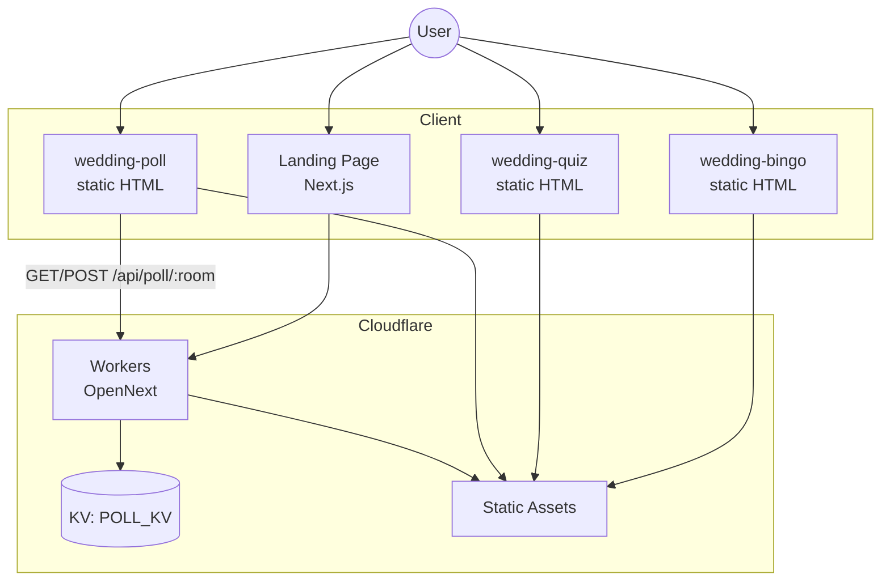
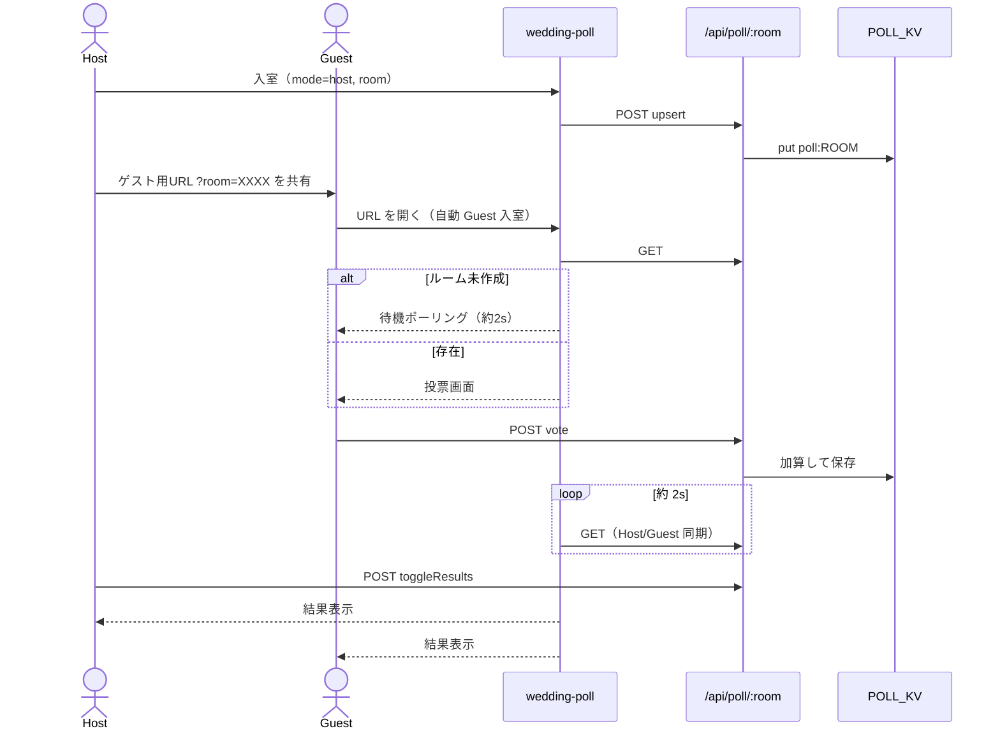

# ことほぎ — 設計書

| 項目 | 内容 |
|------|------|
| プロダクト名 | ことほぎ（Kotohogi） |
| 文書バージョン | 1.2 |
| 最終更新 | 2026-07-18 |
| この文書の役割 | **「どう作っているか」**の正本（構成・API・データ・デプロイ） |
| 要件（何を作るか） | [requirements.md](./requirements.md) |

関連: [docs 目次](./README.md) · [ロードマップ](./roadmap.md) · [自動テスト](./test-spec.md) · [シナリオ](./scenario-spec.md) · [テスト手順](./ops/testing.md) · [プレビュー手順](./ops/preview.md)

---

## 0. この文書の読み方

設計書は、要件を満たすための**実装の地図**です。ファイルパス・API・データ形・デプロイの事実をここに揃えます。

| 読みたいこと | 読む節 |
|--------------|--------|
| 全体のつながりの図 | §1 |
| リポジトリのどこに何があるか | §2・§0.1 |
| 技術の一覧 | §3 |
| LP / ビンゴ / クイズ / アンケート | §4〜§8 |
| Cloudflare・デプロイ・テストとの関係 | §9 |
| セキュリティ上の注意 | §10 |
| これから足すもの | §11 → [roadmap.md](./roadmap.md) |

要件 ID（P-05 など）との対応を変えたり、API の振る舞いを変えたりしたら、この文書とテスト仕様を同じ変更の中で更新してください。

---

## 0.1 関係資材マップ

| 領域 | パス | この文書 |
|------|------|----------|
| LP ページ | `src/app/page.tsx`, `src/app/layout.tsx` | §4 |
| LP セクション部品 | `src/components/landing/` | §4 |
| リンク・文言設定 | `src/config/site.ts` | §4.2 |
| アンケート API | `src/app/api/poll/[room]/route.ts` | §8.6 |
| ルーム／票の正規化 | `src/lib/poll.ts` | §8.6（単体テスト対象） |
| KV / メモリ永続化 | `src/lib/poll-store.ts` | §8.5 |
| ビンゴ | `public/app-tools/wedding-bingo/index.html` | §6 |
| クイズ | `public/app-tools/wedding-quiz/index.html` | §7 |
| アンケート UI | `public/app-tools/wedding-poll/index.html` | §8 |
| 幹事・進行ツール群 | `public/app-tools/{slug}/`, `public/app-tools/index.html` | §8b |
| 余興共通ロジック | `public/app-tools/shared/party-logic.js` | §5.3 |
| 余興共通スタイル | `public/app-tools/shared/app.css` | §5.4 |
| URL 圧縮 | `public/app-tools/shared/pack.js` | §5.2 |
| Workers / KV 設定 | `wrangler.jsonc` | §9.1 |
| OpenNext | `open-next.config.ts`, `next.config.ts` | §9 |
| CI / Deploy | `.github/workflows/` | §9.2–9.3 |
| 単体 / E2E 設定 | `vitest.config.ts`, `playwright.config.ts`, `e2e/` | §9.3 · [ops/testing.md](./ops/testing.md) |
| 内部文書 | `docs/` | [README.md](./README.md) |
| Agent チェックリスト | `.cursor/skills/kotohogi-cloudflare/` | 仕様の正は docs |

**余興 UI は `public/app-tools/` のみ。** `src/app` に HTML アプリ本体を置かない（静的配信と責務分離のため）。

---

## 1. システム概要



**設計方針（なぜこうするか）**

- LP と API は Next.js（App Router）+ OpenNext で Workers に載せる → 1つのデプロイ単位で紹介サイトと API を出せる
- 余興アプリ本体は `public/app-tools/` の静的 HTML → 依存が少なく、会場スマホでも軽い
- ビンゴ／クイズは **URL 埋め込み共有**（DB 不要）→ 幹事が設定を配るだけで足りる
- アンケートのみ **サーバー同期**（本番 KV / ローカルはメモリ）→ 全員の票を共有する必要があるため

状態の置き場の要約:

| 置き場 | 用途 | 例 |
|--------|------|----|
| 端末 localStorage | 個人状態 | ビンゴの名前、投票済み |
| URL（`?c=` + UrlPack） | 設定の配布 | ビンゴマス、クイズ問題 |
| Cloudflare KV（`POLL_KV`） | 端末横断の共有 | アンケート票・進行 |

---

## 2. リポジトリ構成

```
party-entertainment-hub/
├── docs/                      # 内部文書（サイト非公開）— 目次は docs/README.md
│   ├── requirements.md        # 要件（正）
│   ├── design.md              # 設計（正・この文書）
│   ├── test-spec.md           # 自動テスト仕様
│   ├── scenario-spec.md       # シナリオテスト仕様
│   ├── roadmap.md             # 次の施策
│   ├── ops/                   # 運用手順（testing / preview）
│   └── drafts/                # 記事など外部公開用下書き
├── e2e/                       # シナリオ E2E（ガーキン + Playwright）
├── scripts/                   # smoke.mjs など
├── src/
│   ├── app/                   # LP・API
│   │   ├── page.tsx           # ランディング
│   │   ├── layout.tsx
│   │   └── api/poll/[room]/  # アンケート API
│   ├── components/landing/    # LP セクション
│   ├── config/site.ts         # リンク・文言の単一設定源
│   └── lib/
│       ├── poll.ts            # ルーム／票の正規化（単体テスト対象）
│       └── poll-store.ts      # KV / メモリ永続化
├── public/
│   ├── _headers
│   └── app-tools/
│       ├── index.html         # 余興アプリ一覧（ハブ）
│       ├── shared/pack.js     # URL 圧縮共有
│       ├── shared/party-logic.js  # 余興共通ロジック（単体テスト対象）
│       ├── shared/app.css     # 余興共通スタイル
│       ├── wedding-bingo/     # 人間ビンゴ
│       ├── wedding-quiz/      # 新郎新婦クイズ
│       ├── wedding-poll/      # リアルタイムアンケート
│       ├── bingo-machine/     # ビンゴ数字抽選機
│       ├── roulette/          # 抽選ルーレット
│       ├── amidakuji/         # あみだくじ
│       ├── group-maker/       # グループ分け
│       ├── order-picker/      # 順番決め
│       ├── warikan/           # 割り勘計算機
│       ├── king-game/         # 王様ゲーム
│       ├── talk-theme/        # トークテーマガチャ
│       ├── countdown/         # カウントダウンタイマー
│       └── scoreboard/        # 得点板
├── wrangler.jsonc             # Workers / KV バインディング
├── open-next.config.ts
├── next.config.ts
├── vitest.config.ts
├── playwright.config.ts
└── .github/workflows/         # Test（Quality）/ Deploy（品質ゲート必須）
```

Git に含めない生成物: `node_modules/`, `.next/`, `.open-next/`, `.wrangler/`, `test-results/`, `playwright-report/`, `.features-gen/`（`.gitignore` 参照）

---

## 3. 技術スタック

| 層 | 技術 |
|----|------|
| LP / API | Next.js 15, React 19, Tailwind CSS v4, Lucide |
| 実行基盤 | Cloudflare Workers（`@opennextjs/cloudflare`） |
| アンケート永続化 | Cloudflare KV（`POLL_KV`）、TTL 24h |
| 静的アプリ | HTML / CSS / Vanilla JS |
| URL 圧縮 | LZ-String + `public/app-tools/shared/pack.js` |
| Worker 名 | `kotohogi`（`wrangler.jsonc`） |
| 単体テスト | Vitest（`npm test`） |
| シナリオ E2E | Playwright + playwright-bdd（ガーキン、`npm run test:e2e`） |

---

## 4. ランディングページ設計

### 4.1 画面構成

`src/app/page.tsx` が以下を縦に配置:

1. Hero
2. ProblemSolution
3. Features（各アプリへのリンク）
4. Affiliate
5. Footer

コンポーネント実体は `src/components/landing/` 配下です。

### 4.2 設定

`src/config/site.ts` がコピー・URL の単一ソース（要件 LP-04 / LP-05）。  
機能リンク例:

- `/app-tools/wedding-bingo/index.html`
- `/app-tools/wedding-quiz/index.html`
- `/app-tools/wedding-poll/index.html`

### 4.3 スタイル

- 表示: Cormorant Garamond
- 本文: Zen Kaku Gothic New
- `layout.tsx` の metadata は `siteConfig` 由来
- トーンの CSS 変数は `globals.css`（cool paper / ink / muted champagne）

---

## 5. 静的アプリ共通設計

### 5.1 配信

Next / OpenNext の静的アセットとして `public/` 以下を配信。パスは上記 URL のとおり。

### 5.2 URL パック（ビンゴ・クイズ）

`UrlPack`（`public/app-tools/shared/pack.js`）:

| 関数 | 役割 |
|------|------|
| `pack` / `unpack` | JSON ↔ LZ 圧縮文字列 |
| `readFromLocation` | `?c=` または hash から復元 |
| `buildShareUrl` / `copyShareUrl` | 共有 URL 生成・コピー |

**ビンゴ payload:** `{ v: 1, l: string[8] }`（ラベルのみ。入力名は含めない）  
**クイズ payload:** `{ v: 1, q: [ [question, choices[], answerIndex], ... ] }`

読み込み優先度（クイズ）: URL `?c=` → localStorage → デフォルト問題

### 5.3 共通ロジック（party-logic.js）

TOOL-\*（§8b）で使う乱数系の純粋関数を `public/app-tools/shared/party-logic.js` に集約する。DOM に触れず、乱数の種を外から渡せるため**単体テスト可能**（UT-PARTY-\*）。

- 形式: UMD 風。ブラウザでは `window.PartyLogic`、Node（Vitest）では `import` できる
- 型: 同ディレクトリの `party-logic.d.ts`
- 主な関数: `mulberry32`（種つき乱数）, `shuffle`, `drawOne`, `splitIntoGroups`, `splitBySize`, `bingoNumbers`, `bingoLetter`, `splitBill`, `generateLadder`, `resolveLadder`, `kingGame`
- テスト: `src/lib/party-logic.test.ts`（[test-spec.md §6](./test-spec.md)）

### 5.4 共通スタイル（app.css）

余興アプリの見た目（紙×金トーン・カード・ボタン・モーダル・使い方ノート）は `public/app-tools/shared/app.css` に集約し、各アプリは固有分のみ個別 `<style>` で足す。favicon も `shared/favicon.svg` を共有。

---

## 6. 人間ビンゴ設計

**ファイル:** `public/app-tools/wedding-bingo/index.html`  
**要件:** B-01〜B-08

| 項目 | 内容 |
|------|------|
| 盤面 | 3×3。中央 index 4 は FREE（表示名「主役の2人」） |
| 勝利条件 | 8 ライン（行・列・斜め）。完成ライン数を表示 |
| 達成時刻 | 初回ビンゴ時のみ `toLocaleString('ja-JP')`（年月日＋時分秒） |
| 永続化 | `localStorage`: `bingoLabels`, `bingoNames` |
| 管理 | タイトル 3 連打、または編集 UI からラベル編集・共有 URL |

---

## 7. 新郎新婦クイズ設計

**ファイル:** `public/app-tools/wedding-quiz/index.html`  
**要件:** Q-01〜Q-06

| 項目 | 内容 |
|------|------|
| 出題 | 複数問・各4択・正解 index |
| フィードバック | 即時正誤 → 最終スコア・レビュー |
| 永続化 | `localStorage`: `weddingQuizQuestions` |
| 管理 | 問題追加・削除・正解設定・共有 URL |

---

## 8. リアルタイムアンケート設計

**UI:** `public/app-tools/wedding-poll/index.html`  
**API:** `src/app/api/poll/[room]/route.ts`  
**要件:** P-01〜P-11

### 8.1 ロール

| ロール | 責務 |
|--------|------|
| Host | ルーム upsert、質問切替、結果公開、票クリア、**質問・選択肢の編集**。**投票不可** |
| Guest | 投票のみ。結果は Host 公開後に表示 |

### 8.2 画面フロー



### 8.3 URL

| URL | 動作 |
|-----|------|
| `.../wedding-poll/index.html?room=XXXX` | Guest として自動入室 |
| `...?room=XXXX&mode=host` | Host モードを選択（入室はボタン操作が必要） |
| `...?mode=guest` | Guest 選択（room があれば自動入室） |

Host 画面の「ゲスト用 URL」は `guestInviteUrl(room)` で生成し、コピー可能。  
質問文・選択肢の編集は Host の **「質問・選択肢を編集」**（入室前の開始画面にも同ボタン）。保存時は `upsert` でルームへ反映し、票はリセットする（要件 P-10）。

### 8.4 クライアント状態

| キー | 内容 |
|------|------|
| `weddingPollQuestions` | Host 編集中の質問ドラフト |
| `weddingPollMyVotes_{ROOM}` | `{ [questionIndex]: choiceIndex }` 二重投票防止（端末単位） |

同期: セッション中 `setInterval(refreshSession, 2000)`  
Guest 待機: Host 未作成時も約 **2秒** 間隔で GET リトライ

### 8.5 セッションデータモデル

```ts
type PollQuestion = { q: string; choices: string[] };

type PollSession = {
  room: string;           // 正規化済み 4 文字
  index: number;          // 現在の質問
  showResults: boolean;
  votes: number[][];      // votes[q][choice]
  questions: PollQuestion[];
  updatedAt: number;      // 変更検知用
};
```

永続化キー: `poll:{ROOM}`  
TTL: 24 時間（KV `expirationTtl`）  
ローカル: `globalThis.__weddingPollMemory`（KV が無いとき）

実装: `src/lib/poll-store.ts`

### 8.6 API 設計

**エンドポイント:** `/api/poll/[room]`  
**正規化:** `normalizeRoom` / `normalizeVotes` は `src/lib/poll.ts`。API（`route.ts`）は正規化後の長さがちょうど 4 であることを検証する。

| Method | action | 説明 |
|--------|--------|------|
| GET | — | セッション取得。無ければ 404 |
| POST | `upsert` | 作成・更新（questions 必須） |
| POST | `vote` | 票を +1 |
| POST | `tally` | 票 +1 かつ `showResults=true`（互換用。現行 UI は主に `vote`） |
| POST | `setIndex` | 質問 index 変更、`showResults=false` |
| POST | `toggleResults` | 結果表示トグル |
| POST | `clearVotes` | 現在質問の票をゼロ |

**整合性:** 読み取り→加算→書き込み。高並行時に稀に取りこぼしうるが、会場規模では許容（要件 N-03）。

---

## 8b. 幹事・進行ツール群（TOOL-\*）設計

**要件:** T-01〜T-06 / **一覧:** `public/app-tools/index.html`

集客と当日運用を狙った単機能の静的アプリ群。共通ロジック（§5.3）と共通スタイル（§5.4）の上に構築し、**サーバー同期・DB は使わない**（端末内で完結）。

| slug | 主な要素 ID（E2E 目印） | 使うロジック |
|------|--------------------------|--------------|
| `bingo-machine` | `#draw-btn` `#current-number` `#drawn-count` | `bingoNumbers` `bingoLetter` `drawOne` |
| `roulette` | `#names-input` `#spin-btn` `#winner` | Canvas 描画（乱数は当選 index） |
| `amidakuji` | `#names-input` `#reveal-btn` `#result-list` | `generateLadder` `resolveLadder` |
| `group-maker` | `#names-input` `#split-btn` `#groups` | `splitIntoGroups` `splitBySize` |
| `order-picker` | `#names-input` `#shuffle-btn` `#order-list` | `shuffle` |
| `warikan` | `#total-input` `#people-input` `#calc-btn` `#warikan-result` | `splitBill` |
| `king-game` | `#count-input` `#deal-btn` `#king-btn` | `kingGame` `drawOne` |
| `talk-theme` | `#category-select` `#draw-btn` `#theme-display` | `drawOne` |
| `countdown` | `#minutes-input` `#start-btn` `#timer-display` | （タイマー） |
| `scoreboard` | `#scoreboard` `#add-team-btn` | （得点加減算） |

共通事項:

- 画面上部に「使い方の要点」（`#app-howto`）を表示（要件 T-03）
- 各ページに固有の `title` / `description` / `canonical` / OGP を持ち、**sitemap（`src/app/sitemap.ts`）に登録**（要件 T-04）
- LP（`src/config/site.ts` の `features`）と一覧ページから導線（要件 T-05）
- 入力は必要に応じて localStorage 保存（要件 T-06）
- 分析ビーコン `/cf-web-analytics.js` を各ページに読み込む

---

## 9. Cloudflare / デプロイ設計

### 9.1 wrangler

`wrangler.jsonc` 要点:

- `name`: `kotohogi`
- `main`: `.open-next/worker.js`
- `assets.directory`: `.open-next/assets`
- `compatibility_flags`: `nodejs_compat`, `global_fetch_strictly_public`
- `kv_namespaces`: binding `POLL_KV`
- `services`: `WORKER_SELF_REFERENCE` → 自身

### 9.2 ビルド／デプロイ

| 方法 | 内容 |
|------|------|
| 手元 / GitHub Actions | `npm run deploy`（`opennextjs-cloudflare build` + `opennextjs-cloudflare deploy`） |
| Cloudflare Git 連携（ダッシュボード） | Build: `npx opennextjs-cloudflare build` → Deploy: `npx wrangler deploy`（設定例） |
| GitHub Actions Deploy | `.github/workflows/deploy-cloudflare.yml`（先に Quality＝単体+E2E） |

非本番ブランチでの確認手順は [ops/preview.md](./ops/preview.md)。

### 9.3 自動テスト（概要）

品質ゲートの詳細は [test-spec.md](./test-spec.md) / [ops/testing.md](./ops/testing.md) / [scenario-spec.md](./scenario-spec.md)。

| 層 | 道具 | 入口 | 主なファイル |
|----|------|------|--------------|
| 単体 | Vitest | `npm test`、husky pre-push、CI `unit` | `src/lib/*.test.ts`, `.husky/pre-push` |
| シナリオ E2E | Playwright + ガーキン | `npm run test:e2e`、CI `e2e`（動画あり） | `e2e/`, `playwright.config.ts` |
| スモーク（任意） | `scripts/smoke.mjs` | `SMOKE_BASE_URL` 指定時 | `scripts/smoke.mjs` |

### 9.4 環境差分

| 環境 | アンケート同期 |
|------|----------------|
| 本番 Workers | Cloudflare KV |
| `next dev` / E2E 既定 | メモリ Map（インスタンス単一前提） |

いまの既知の負債: `preview_id` が本番 KV と同じ ID を指しうる → 分離は [roadmap.md](./roadmap.md) / [ops/preview.md](./ops/preview.md)。

---

## 10. セキュリティ・運用上の注意

- ルームコードは短く推測可能なため、**秘匿情報や個人の機微データの収集に使わない**
- Guest の二重投票防止は localStorage 依存（端末・ブラウザ単位）。厳密な本人確認は行わない
- KV ID・API Token 等の秘密情報をドキュメントや公開 Issue に書かない（`wrangler.jsonc` の namespace id はアカウント固有のため取扱注意）
- `.dev.vars` / `.env*` は Git に含めない

---

## 11. 今後の拡張

未着手の施策・優先度は **[roadmap.md](./roadmap.md)** を正とする。  
設計に影響する決定が出たら、この文書を更新する。

---

## 12. 次に読むもの

| 目的 | 文書 |
|------|------|
| 機能要件・受け入れ | [requirements.md](./requirements.md) |
| テスト仕様 | [test-spec.md](./test-spec.md) |
| シナリオ | [scenario-spec.md](./scenario-spec.md) |
| 実行コマンド・pre-push | [ops/testing.md](./ops/testing.md) |
| 非本番確認 | [ops/preview.md](./ops/preview.md) |
| docs 全体 | [README.md](./README.md) |
