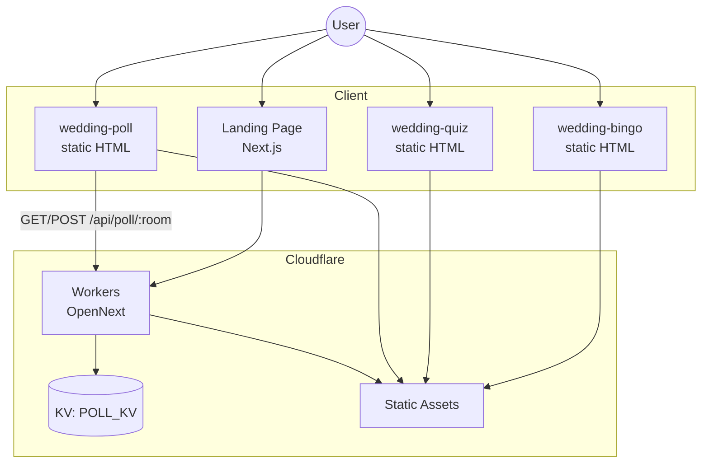
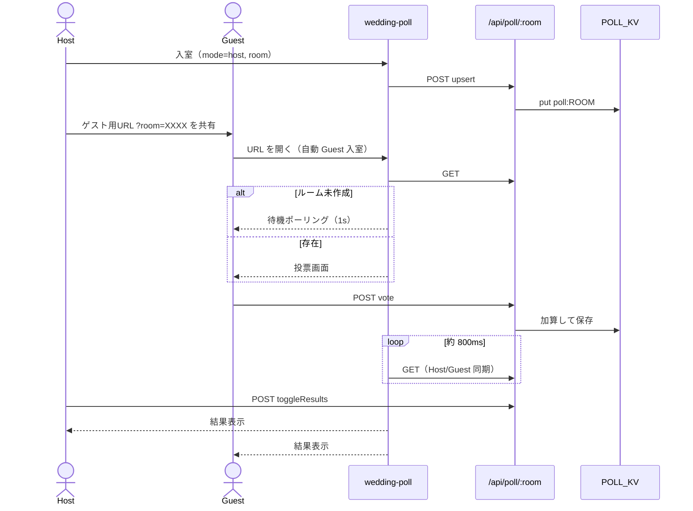

# ことほぎ — 設計書

| 項目 | 内容 |
|------|------|
| プロダクト名 | ことほぎ（Kotohogi） |
| 文書バージョン | 1.0 |
| 最終更新 | 2026-07-18 |

関連: [要件定義書](./requirements.md)

---

## 1. システム概要



**設計方針**

- LP と API は Next.js（App Router）+ OpenNext で Workers に載せる
- 余興アプリ本体は `public/app-tools/` の静的 HTML（依存少なく、会場スマホでも軽い）
- ビンゴ／クイズは **URL 埋め込み共有**（DB 不要）
- アンケートのみ **サーバー同期**（本番 KV / ローカルはメモリ）

---

## 2. リポジトリ構成

```
party-entertainment-hub/
├── docs/                      # 本ドキュメント（サイト非公開）
├── src/
│   ├── app/                   # LP・API
│   │   ├── page.tsx           # ランディング
│   │   ├── layout.tsx
│   │   └── api/poll/[room]/  # アンケート API
│   ├── components/landing/    # LP セクション
│   ├── config/site.ts         # リンク・文言の単一設定源
│   └── lib/poll-store.ts      # KV / メモリ永続化
├── public/
│   ├── _headers
│   └── app-tools/
│       ├── shared/pack.js     # URL 圧縮共有
│       ├── wedding-bingo/
│       ├── wedding-quiz/
│       └── wedding-poll/
├── wrangler.jsonc             # Workers / KV バインディング
├── open-next.config.ts
├── next.config.ts
└── .github/workflows/         # 任意の CI デプロイ
```

Git に含めない生成物: `node_modules/`, `.next/`, `.open-next/`, `.wrangler/`（`.gitignore` 参照）

---

## 3. 技術スタック

| 層 | 技術 |
|----|------|
| LP / API | Next.js 15, React 19, Tailwind CSS v4, Lucide |
| 実行基盤 | Cloudflare Workers（`@opennextjs/cloudflare`） |
| アンケート永続化 | Cloudflare KV（`POLL_KV`）、TTL 24h |
| 静的アプリ | HTML / CSS / Vanilla JS |
| URL 圧縮 | LZ-String + `public/app-tools/shared/pack.js` |
| Worker 名 | `kotohogi`（`wrangler.jsonc`） |

---

## 4. ランディングページ設計

### 4.1 画面構成

`src/app/page.tsx` が以下を縦に配置:

1. Hero
2. ProblemSolution
3. Features（各アプリへのリンク）
4. Affiliate
5. Footer

### 4.2 設定

`src/config/site.ts` がコピー・URL の単一ソース。  
機能リンク例:

- `/app-tools/wedding-bingo/index.html`
- `/app-tools/wedding-quiz/index.html`
- `/app-tools/wedding-poll/index.html`

### 4.3 スタイル

- 表示: Cormorant Garamond
- 本文: Zen Kaku Gothic New
- `layout.tsx` の metadata は `siteConfig` 由来

---

## 5. 静的アプリ共通設計

### 5.1 配信

Next / OpenNext の静的アセットとして `public/` 以下を配信。パスは上記 URL のとおり。

### 5.2 URL パック（ビンゴ・クイズ）

`UrlPack`（`pack.js`）:

| 関数 | 役割 |
|------|------|
| `pack` / `unpack` | JSON ↔ LZ 圧縮文字列 |
| `readFromLocation` | `?c=` または hash から復元 |
| `buildShareUrl` / `copyShareUrl` | 共有 URL 生成・コピー |

**ビンゴ payload:** `{ v: 1, l: string[8] }`（ラベルのみ。入力名は含めない）  
**クイズ payload:** `{ v: 1, q: [ [question, choices[], answerIndex], ... ] }`

読み込み優先度（クイズ）: URL `?c=` → localStorage → デフォルト問題

---

## 6. 人間ビンゴ設計

**ファイル:** `public/app-tools/wedding-bingo/index.html`

| 項目 | 内容 |
|------|------|
| 盤面 | 3×3。中央 index 4 は FREE（表示名「主役の2人」） |
| 勝利条件 | 8 ライン（行・列・斜め）。完成ライン数を表示 |
| 達成時刻 | 初回ビンゴ時のみ `toLocaleString('ja-JP')`（年月日＋時分秒） |
| 永続化 | `localStorage`: `bingoLabels`, `bingoNames` |
| 管理 | タイトル 3 連打、または編集 UI からラベル編集・共有 URL |

---

## 7. 新郎新婦クイズ設計

**ファイル:** `public/app-tools/wedding-quiz/index.html`

| 項目 | 内容 |
|------|------|
| 出題 | 複数問・各4択・正解 index |
| フィードバック | 即時正誤 → 最終スコア・レビュー |
| 永続化 | `localStorage`: `weddingQuizQuestions` |
| 管理 | 問題追加・削除・正解設定・共有 URL |

---

## 8. リアルタイムアンケート設計

### 8.1 ロール

| ロール | 責務 |
|--------|------|
| Host | ルーム upsert、質問切替、結果公開、票クリア。**投票不可** |
| Guest | 投票のみ。結果は Host 公開後に表示 |

### 8.2 画面フロー



### 8.3 URL

| URL | 動作 |
|-----|------|
| `.../wedding-poll/index.html?room=XXXX` | Guest として自動入室 |
| `...?room=XXXX&mode=host` | Host として開く |
| `...?mode=guest` | Guest 選択（room があれば自動入室） |

Host 画面の「ゲスト用 URL」は `guestInviteUrl(room)` で生成し、コピー可能。

### 8.4 クライアント状態

| キー | 内容 |
|------|------|
| `weddingPollQuestions` | Host 編集中の質問ドラフト |
| `weddingPollMyVotes_{ROOM}` | `{ [questionIndex]: choiceIndex }` 二重投票防止（端末単位） |

同期: セッション中 `setInterval(refreshSession, 800)`  
Guest 待機: Host 未作成時 `setInterval(..., 1000)` で GET リトライ

### 8.5 セッションデータモデル

```ts
type PollQuestion = { q: string; choices: string[] };

type PollSession = {
  room: string;           // 正規化済み 4 文字
  index: number;          // 現在の質問
  showResults: boolean;
  votes: number[][];      // votes[q][choice]
  questions: PollQuestion[];
  updatedAt: number;      // 変更検知用
};
```

永続化キー: `poll:{ROOM}`  
TTL: 24 時間（KV `expirationTtl`）  
ローカル: `globalThis.__weddingPollMemory`（KV が無いとき）

実装: `src/lib/poll-store.ts`

### 8.6 API 設計

**エンドポイント:** `/api/poll/[room]`  
**正規化:** 大文字英数字、長さちょうど 4（`src/app/api/poll/[room]/route.ts`）

| Method | action | 説明 |
|--------|--------|------|
| GET | — | セッション取得。無ければ 404 |
| POST | `upsert` | 作成・更新（questions 必須） |
| POST | `vote` | 票を +1 |
| POST | `tally` | 票 +1 かつ `showResults=true`（互換用。現行 UI は主に `vote`） |
| POST | `setIndex` | 質問 index 変更、`showResults=false` |
| POST | `toggleResults` | 結果表示トグル |
| POST | `clearVotes` | 現在質問の票をゼロ |

**整合性:** 読み取り→加算→書き込み。高並行時に稀に取りこぼしうるが、二次会規模では許容（要件 N-03）。

---

## 9. Cloudflare / デプロイ設計

### 9.1 wrangler

`wrangler.jsonc` 要点:

- `name`: `kotohogi`
- `main`: `.open-next/worker.js`
- `assets.directory`: `.open-next/assets`
- `compatibility_flags`: `nodejs_compat`, `global_fetch_strictly_public`
- `kv_namespaces`: binding `POLL_KV`
- `services`: `WORKER_SELF_REFERENCE` → 自身

### 9.2 ビルド／デプロイ

| 方法 | 内容 |
|------|------|
| 手動 | `npm run deploy`（OpenNext build + deploy） |
| Cloudflare Git 連携 | Build: `npx opennextjs-cloudflare build` → Deploy: `npx wrangler deploy` |
| GitHub Actions | `.github/workflows/deploy-cloudflare.yml`（Secrets: API Token / Account ID） |

### 9.3 環境差分

| 環境 | アンケート同期 |
|------|----------------|
| 本番 Workers | Cloudflare KV |
| `next dev` | メモリ Map（インスタンス単一前提） |

---

## 10. セキュリティ・運用上の注意

- ルームコードは短く推測可能なため、**秘匿情報や個人の機微データの収集に使わない**
- Guest の二重投票防止は localStorage 依存（端末・ブラウザ単位）。厳密な本人確認は行わない
- KV ID・API Token 等の秘密情報をドキュメントや公開 Issue に書かない（`wrangler.jsonc` の namespace id はアカウント固有のため取扱注意）

---

## 11. 今後の拡張候補

- アンケートの Durable Objects 等による厳密な同時投票制御
- ゲスト URL の QR コード自動表示
- ビンゴ／クイズのホスト画面とゲスト画面の分離
- カスタムドメイン・ブランドアセットの本番差し替え
