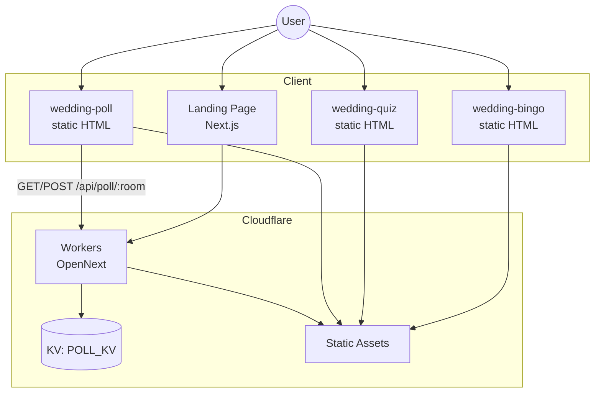
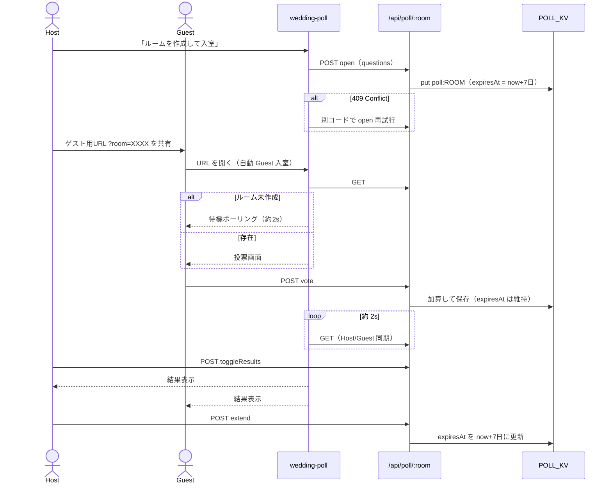

# ことほぎ — 設計書

| 項目 | 内容 |
|------|------|
| プロダクト名 | ことほぎ（Kotohogi） |
| 文書バージョン | 1.2 |
| 最終更新 | 2026-07-18 |
| この文書の役割 | **「どう作っているか」**の正本（構成・API・データ・デプロイ） |
| 要件（何を作るか） | [requirements.md](./requirements.md) |

関連: [docs 目次](./README.md) · [ロードマップ](./roadmap.md) · [自動テスト](./test-spec.md) · [シナリオ](./scenario-spec.md) · [テスト手順](./ops/testing.md) · [プレビュー手順](./ops/preview.md)

---

## 0. この文書の読み方

設計書は、要件を満たすための**実装の地図**です。ファイルパス・API・データ形・デプロイの事実をここに揃えます。

| 読みたいこと | 読む節 |
|--------------|--------|
| 全体のつながりの図 | §1 |
| リポジトリのどこに何があるか | §2・§0.1 |
| 技術の一覧 | §3 |
| LP / ビンゴ / クイズ / アンケート | §4〜§8 |
| Cloudflare・デプロイ・テストとの関係 | §9 |
| セキュリティ上の注意 | §10 |
| これから足すもの | §11 → [roadmap.md](./roadmap.md) |

要件 ID（P-05 など）との対応を変えたり、API の振る舞いを変えたりしたら、この文書とテスト仕様を同じ変更の中で更新してください。

---

## 0.1 関係資材マップ

| 領域 | パス | この文書 |
|------|------|----------|
| LP ページ | `src/app/page.tsx`, `src/app/layout.tsx` | §4 |
| LP セクション部品 | `src/components/landing/` | §4 |
| リンク・文言設定 | `src/config/site.ts` | §4.2 |
| アンケート API | `src/app/api/poll/[room]/route.ts` | §8.6 |
| ルーム／票の正規化 | `src/lib/poll.ts` | §8.6（単体テスト対象） |
| KV 共通（get/put/list） | `src/lib/kv.ts` | §3.1 |
| ゲスト匿名セッション | `src/lib/guest-session.ts`, `src/hooks/use-guest-session.ts` | §3.1 |
| ロール入口（Guest/Screen/Admin） | `src/app/{guest,screen,admin}/` | §3.1 |
| ライブ余興 UI / API | `src/app/live/`, `src/components/live/`, `src/app/api/live/` | §3.2 |
| ライブ余興ロジック | `src/lib/live/` | §3.2 |
| KV / メモリ永続化 | `src/lib/poll-store.ts` ほか（`kv.ts` 経由） | §8.5 |
| ビンゴ | `public/app-tools/wedding-bingo/index.html` | §6 |
| クイズ | `public/app-tools/wedding-quiz/index.html` | §7 |
| アンケート UI | `public/app-tools/wedding-poll/index.html` | §8 |
| 祝福メッセージ | `public/app-tools/wishboard/`, `src/app/api/wish/`, `src/lib/wish*.ts` | §8c |
| 幹事・進行ツール群 | `public/app-tools/{slug}/`（一覧は LP `#tools`） | §8b |
| 余興共通ロジック | `public/app-tools/shared/party-logic.js` | §5.3 |
| 余興共通スタイル | `public/app-tools/shared/app.css` | §5.4 · [ui-design.md](./ui-design.md) |
| URL 圧縮 | `public/app-tools/shared/pack.js` | §5.2 |
| Workers / KV 設定 | `wrangler.jsonc` | §9.1 |
| OpenNext | `open-next.config.ts`, `next.config.ts` | §9 |
| CI / Deploy | `.github/workflows/` | §9.2–9.3 |
| 単体 / E2E 設定 | `vitest.config.ts`, `playwright.config.ts`, `e2e/` | §9.3 · [ops/testing.md](./ops/testing.md) |
| 内部文書 | `docs/` | [README.md](./README.md) |
| Agent チェックリスト | `.cursor/skills/kotohogi-cloudflare/` | 仕様の正は docs |

**余興 UI は `public/app-tools/` のみ。** `src/app` に HTML アプリ本体を置かない（静的配信と責務分離のため）。

---

## 1. システム概要



**設計方針（なぜこうするか）**

- LP と API は Next.js（App Router）+ OpenNext で Workers に載せる → 1つのデプロイ単位で紹介サイトと API を出せる
- 余興アプリ本体は `public/app-tools/` の静的 HTML → 依存が少なく、会場スマホでも軽い
- ビンゴ／クイズは **URL 埋め込み共有**（DB 不要）→ 幹事が設定を配るだけで足りる
- アンケート・祝福メッセージ（およびビンゴ／クイズ任意集計）は **サーバー同期**（本番 KV / ローカルはメモリ）→ 端末横断で共有する必要があるため

状態の置き場の要約:

| 置き場 | 用途 | 例 |
|--------|------|----|
| 端末 localStorage | 個人状態 | ビンゴの名前、投票済み |
| URL（`?c=` + UrlPack） | 設定の配布 | ビンゴマス、クイズ問題 |
| Cloudflare KV（`POLL_KV`） | 端末横断の共有 | アンケート票・進行 |

---

## 2. リポジトリ構成

```
party-entertainment-hub/
├── docs/                      # 内部文書（サイト非公開）— 目次は docs/README.md
│   ├── requirements.md        # 要件（正）
│   ├── design.md              # 設計（正・この文書）
│   ├── test-spec.md           # 自動テスト仕様
│   ├── scenario-spec.md       # シナリオテスト仕様
│   ├── roadmap.md             # 次の施策
│   ├── ops/                   # 運用手順（testing / preview）
│   └── drafts/                # 記事など外部公開用下書き
├── e2e/                       # シナリオ E2E（ガーキン + Playwright）
├── scripts/                   # smoke.mjs など
├── src/
│   ├── app/                   # LP・API・ロール入口
│   │   ├── page.tsx           # ランディング
│   │   ├── layout.tsx
│   │   ├── guest/             # Guest ロール入口（匿名セッション）
│   │   ├── screen/            # Screen ロール入口（会場映し出し）
│   │   ├── admin/             # Admin ロール入口（司会・幹事）
│   │   └── api/poll/[room]/  # アンケート API
│   ├── components/landing/    # LP セクション（Hero / ToolsGrid 等）
│   ├── config/site.ts         # リンク・文言の単一設定源
│   └── lib/
│       ├── kv.ts              # POLL_KV 共通 get/put/list（単体テスト対象）
│       ├── guest-session.ts   # 匿名 UUID（localStorage + Cookie）
│       ├── poll.ts            # ルーム／票の正規化（単体テスト対象）
│       ├── poll-store.ts      # アンケート永続化（kv.ts 経由）
│       ├── bingo-store.ts     # ビンゴ集計（kv.ts 経由）
│       ├── quiz-store.ts      # クイズ集計（kv.ts 経由）
│       ├── wish.ts            # 寄せ書き正規化（単体テスト対象）
│       └── wish-store.ts      # 寄せ書き（kv.ts 経由）
├── public/
│   ├── _headers
│   └── app-tools/
│       ├── index.html         # 旧ハブ → `/#tools` リダイレクトのみ
│       ├── shared/pack.js     # URL 圧縮共有
│       ├── shared/party-logic.js  # 余興共通ロジック（単体テスト対象）
│       ├── shared/ui.js       # 余興共通 UI 部品
│       ├── shared/app.css     # 余興共通スタイル
│       ├── wedding-bingo/     # 人間ビンゴ
│       ├── wedding-quiz/      # 新郎新婦クイズ
│       ├── wedding-poll/      # リアルタイムアンケート
│       ├── wishboard/         # 祝福メッセージボード
│       ├── table-talk/        # テーブルトークカード
│       ├── photo-mission/     # フォトミッション
│       ├── bingo-machine/     # ビンゴ数字抽選機（範囲選択対応）
│       ├── roulette/          # 抽選ルーレット（コンフェッティ演出）
│       ├── countdown/         # カウントダウンタイマー
│       └── scoreboard/        # 得点板
├── wrangler.jsonc             # Workers / KV バインディング
├── open-next.config.ts
├── next.config.ts
├── vitest.config.ts
├── playwright.config.ts
└── .github/workflows/         # Test（Quality）/ Deploy（品質ゲート必須）
```

Git に含めない生成物: `node_modules/`, `.next/`, `.open-next/`, `.wrangler/`, `test-results/`, `playwright-report/`, `.features-gen/`（`.gitignore` 参照）

---

## 3. 技術スタック

| 層 | 技術 |
|----|------|
| LP / API | Next.js 15, React 19, Tailwind CSS v4, Lucide |
| 実行基盤 | Cloudflare Workers（`@opennextjs/cloudflare`） |
| アンケート永続化 | Cloudflare KV（`POLL_KV`）、TTL 7日（168h）。`expiresAt` をセッションに保存し、Host は `action=extend` で延長可。共通ロジックは `src/lib/room-ttl.ts` |
| 静的アプリ | HTML / CSS / Vanilla JS |
| URL 圧縮 | LZ-String + `public/app-tools/shared/pack.js` |
| Worker 名 | `kotohogi`（`wrangler.jsonc`） |
| 単体テスト | Vitest（`npm test`） |
| シナリオ E2E | Playwright + playwright-bdd（ガーキン、`npm run test:e2e`） |

### 3.1 ロール入口・KV 共通・匿名セッション

PRD の Guest / Screen / Admin に対応する入口を App Router に置く。`/` は従来どおり LP のままにし、余興本体は `public/app-tools/` を維持する。

| パス | 役割 |
|------|------|
| `/` | ランディング（既存） |
| `/guest` | ゲスト向け入口。UUID を localStorage + Cookie（`kotohogi_guest_id`）に保存 |
| `/screen` | 会場スクリーン向け入口（操作最小） |
| `/admin` | 司会・幹事向け入口 |

**KV 共通ユーティリティ**（`src/lib/kv.ts`）:

| 関数 | 用途 |
|------|------|
| `kvGet` / `kvPut` | 単一キーの読み書き。本番は `getCloudflareContext().env.POLL_KV` |
| `kvList` | `prefix` 付き一覧（ゲスト行動を一意キーで put → 集計側 list する設計向け） |
| `kvListAll` | prefix 配下をページングしながら値も取得（ライブ余興の集計向け） |
| （ローカル） | KV が無いときはプロセス内メモリへフォールバック |

既存の `*-store.ts` はすべて `kv.ts` 経由。バインディング名は **`POLL_KV`** 固定（`@cloudflare/next-on-pages` の `getRequestContext` は使わない。本リポジトリは OpenNext）。

### 3.2 ライブ余興（LIVE-\*）

| 項目 | 内容 |
|------|------|
| UI | `/live/{game}/{role}`（role = guest \| screen \| admin） |
| API | `GET/POST /api/live/{game}/{room}`（`dynamic = force-dynamic`） |
| クライアント同期 | SWR `refreshInterval: 1500` |
| 演出 | Framer Motion（Screen の結果表示） |
| 相関図 | `react-force-graph-2d`（Screen のみ） |
| 状態キー | `live:{game}:{room}:state` |
| 行動キー | `live:{game}:{room}:a:{guestId}:{actionId}` |
| 集計 | `kvListAll(prefix)` → `summarizeLive`（純関数・単体テスト対象） |

game ID（現行実装）: `dress`（`/dress/*`） / `graph`（`/graph/*`）

相関図 API: `GET|POST /api/graph/nodes?room=` · `POST /api/graph/admin`（open / reset / extend）。KV: `graph:{room}:meta` · `graph:{room}:node:{userId}`。  
ドレス API: `/api/dress/state` · `/api/dress/vote` · `/api/dress/admin`（open / setColors / extend）。KV: `dress:{room}:meta|state|colors|vote:*`。  
共通 TTL: `src/lib/room-ttl.ts` / UI: `RoomTtlBar` · `PartyUI.updateRoomTtlUi`。

（削除済み）: `buzz` / `digibingo` / `either` / `treasure` / `grade`（ゲスト格付けチェック） / `request`

---

## 4. ランディングページ設計

### 4.1 画面構成

`src/app/page.tsx` が以下を縦に配置:

1. Hero
2. ProblemSolution
3. ToolsGrid（余興・進行ツールのカテゴリ別一覧。`#tools`）
4. Affiliate
5. Footer

コンポーネント実体は `src/components/landing/` 配下です。旧 Features セクションは廃止し、導線は ToolsGrid に集約する。

### 4.2 設定

`src/config/site.ts` がコピー・URL の単一ソース（要件 LP-04 / LP-05）。

| キー | 用途 |
|------|------|
| `siteConfig.tagline` / `description` | ヒーロー・SEO・OGP |
| `problemSolutionIntro` / `problemSolutions` | Problem & Solution セクション（LP-02） |
| `toolItems` / `toolCategories` | ToolsGrid セクション（カテゴリ別ツール一覧） |
| `affiliateBanners` | Affiliate セクション（A8 バナー。余興本体の価値提案とは別枠） |
| `appLinks` | ヒーロー CTA（`#tools` / `#solutions`） |

**コピーの正（2026-07）**

| 項目 | 文言 |
|------|------|
| タグライン | インストール不要。会場のスマホで余興がつながる |
| ヒーロー CTA | **1つだけ**「余興ツールを見る」→ `#tools` |
| Problem 3柱 | 配る手間 / 手元の参加 / 会場の一体感 |

副 CTA（「課題と解決を見る」等）は置かない。課題セクションへは Scroll で進む。

主要アプリのリンク例:

- `/app-tools/wedding-bingo/index.html`
- `/app-tools/wedding-quiz/index.html`
- `/app-tools/wedding-poll/index.html`
- `/app-tools/wishboard/index.html`
- `/app-tools/table-talk/index.html`
- `/app-tools/photo-mission/index.html`

### 4.3 スタイル

- 表示: Cormorant Garamond
- 本文: Zen Kaku Gothic New
- `layout.tsx` の metadata は `siteConfig` 由来
- トーンの CSS 変数は `globals.css`（cool paper / ink / muted champagne）
- ToolsGrid はカード個別の枠線＋`gap` で並べる（`gap-px`＋背景色による空きマスの灰色帯は使わない）

---

## 5. 静的アプリ共通設計

### 5.1 配信

Next / OpenNext の静的アセットとして `public/` 以下を配信。パスは上記 URL のとおり。

### 5.2 URL パック（ビンゴ・クイズ）

`UrlPack`（`public/app-tools/shared/pack.js`）:

| 関数 | 役割 |
|------|------|
| `pack` / `unpack` | JSON ↔ LZ 圧縮文字列 |
| `readFromLocation` | `?c=` または hash から復元 |
| `buildShareUrl` / `copyShareUrl` | 共有 URL 生成・コピー |

**ビンゴ payload:** `{ v: 1, l: string[8] }`（ラベルのみ。入力名は含めない）  
**クイズ payload:** `{ v: 1, q: [ [question, choices[], answerIndex], ... ] }`

読み込み優先度（クイズ）: URL `?c=` → localStorage → デフォルト問題

### 5.3 共通ロジック（party-logic.js）

TOOL-\*（§8b）で使う乱数系の純粋関数を `public/app-tools/shared/party-logic.js` に集約する。DOM に触れず、乱数の種を外から渡せるため**単体テスト可能**（UT-PARTY-\*）。

- 形式: UMD 風。ブラウザでは `window.PartyLogic`、Node（Vitest）では `import` できる
- 型: 同ディレクトリの `party-logic.d.ts`
- 主な関数: `mulberry32`（種つき乱数）, `shuffle`, `drawOne`, `drawDifferent`, `splitIntoGroups`, `splitBySize`, `bingoNumbers`, `bingoLetter`, `splitBill`, `generateLadder`, `resolveLadder`, `kingGame`, `rankScores`, `clampText`, `filterByCategory`, `missionProgress`, `formatWishExport`
- `bingoNumbers()` は既定 1〜75。`bingoNumbers(max)` で 1〜max、`bingoNumbers(from, to)` で任意範囲（UT-PARTY-BINGO-01〜03）
- テスト: `src/lib/party-logic.test.ts`（[test-spec.md §6](./test-spec.md)）

`drawDifferent` は「直前と同じものを引かない」抽選、`rankScores` は同点を同順位にする順位付け（得点板）に使う。

### 5.3b 共通 UI 部品（ui.js）

TOOL-\* の**操作感**にあたる部分を `public/app-tools/shared/ui.js` に集約する。party-logic が「ゲームのルール」なのに対し、こちらは「入力の見せ方・結果の伝え方・会場での操作性」を担当する。

- 形式: party-logic と同じ UMD 風。ブラウザでは `window.PartyUI`、Node（Vitest）では `import`
- 型: 同ディレクトリの `ui.d.ts`
- テスト: `src/lib/app-ui.test.ts`（純粋関数のみ。UT-UI-\*）

| 区分 | 関数 | 役割 |
|------|------|------|
| 純粋（テスト対象） | `escapeHtml` | 参加者名をそのまま `innerHTML` に流しても表示が壊れない・スクリプトが動かない |
| 純粋（テスト対象） | `parseLines` | 複数行入力 →「1行1件」。件数と重複名も返す |
| 純粋（テスト対象） | `formatCount` | 「3名」「未入力（0名）」の件数ラベル |
| 純粋（テスト対象） | `formatNumberedList` / `formatGroups` / `formatPairs` | コピー用テキストの書式 |
| DOM | `setError` / `clearError` / `setHint` | `alert` を使わず、その場に理由を出す |
| DOM | `toast` / `copyText` / `copyWithToast` | 結果のコピーと、操作を止めない通知 |
| DOM | `createWakeLock` | 表示中に画面を消させない（Screen Wake Lock。非対応環境では無視） |
| DOM | `bindShortcuts` | 入力欄にいないときだけ効くキーボード操作 |
| DOM | `prefersReducedMotion` / `initFooterYear` | 演出短縮の判定・フッター年号 |

### 5.4 共通スタイル（app.css）

余興アプリの見た目（紙×金トーン・カード・ボタン・モーダル・使い方ノート）は `public/app-tools/shared/app.css` に集約し、各アプリは固有分のみ個別 `<style>` で足す。favicon も `shared/favicon.svg` を共有。

**見た目の方針の正本は [ui-design.md](./ui-design.md)。** トークン・レイアウト・禁止事項はそちらを更新してから CSS を揃える。

操作性に関わる共通ルールもここに置く。ビンゴ・クイズ・アンケートを含む **`app.css` を読む全ページに一律で効く**。

| 規約 | 内容 |
|------|------|
| フォーカス可視化 | `:focus-visible` に金色のリング。入力欄の `outline: none` を打ち消す |
| タップ領域 | ボタン類は `min-height: 44px` |
| 入力の状態 | `.count-hint`（件数などの補助行）・`.inline-error`（`role="alert"` の理由表示） |
| 結果の持ち帰り | `.result-actions`（結果直下のコピー等）・`.party-toast`（画面下の通知） |
| 動きの配慮 | `prefers-reduced-motion: reduce` でアニメーションを実質停止 |

---

## 6. 人間ビンゴ設計

**ファイル:** `public/app-tools/wedding-bingo/index.html`  
**要件:** B-01〜B-08

| 項目 | 内容 |
|------|------|
| 盤面 | 3×3。中央 index 4 は FREE（表示名「主役の2人」） |
| 勝利条件 | 8 ライン（行・列・斜め）。完成ライン数を表示 |
| 達成時刻 | 初回ビンゴ時のみ `toLocaleString('ja-JP')`（年月日＋時分秒） |
| 永続化 | `localStorage`: `bingoLabels`, `bingoNames` |
| 管理 | タイトル 3 連打、または編集 UI からラベル編集・共有 URL |

### 6.5 ビンゴ集計 API（B-09〜B-12）

**API:** `src/app/api/bingo/[room]/route.ts`  
**ストア:** `src/lib/bingo-store.ts`（KV キー `bingo:{room}`、TTL 7日・`expiresAt`。延長は `action=extend`）

| エンドポイント | method | action | 概要 |
|--------------|--------|--------|------|
| `/api/bingo/[room]` | GET | — | 達成一覧を返す（404 = ルームなし） |
| `/api/bingo/[room]` | POST | `open` | ルームを新規作成（エントリ空） |
| `/api/bingo/[room]` | POST | `report` | `{name}` を達成者として追加 |
| `/api/bingo/[room]` | POST | `clear` | エントリを全削除 |

**フロント動作:**
- 幹事が管理パネルで「ルームコードを生成する」→ POST `open` → Host URL / Guest URL を表示
- Guest が `?room=XXXX` で開き、ビンゴ達成 → 「ビンゴを幹事に報告する」ボタン → モーダルで名前入力 → POST `report`
- Host が `?room=XXXX&mode=host` で開く → ホストビュー（3秒ポーリング）→ 達成者を順番に表示

---

## 7. 新郎新婦クイズ設計

**ファイル:** `public/app-tools/wedding-quiz/index.html`  
**要件:** Q-01〜Q-06

| 項目 | 内容 |
|------|------|
| 出題 | 複数問・各4択・正解 index |
| フィードバック | 即時正誤 → 最終スコア・レビュー |
| 永続化 | `localStorage`: `weddingQuizQuestions` |
| 管理 | 問題追加・削除・正解設定・共有 URL |

### 7.5 クイズ集計 API（Q-07〜Q-10）

**API:** `src/app/api/quiz/[room]/route.ts`  
**ストア:** `src/lib/quiz-store.ts`（KV キー `quiz:{room}`、TTL 7日・`expiresAt`。延長は `action=extend`）

| エンドポイント | method | action | 概要 |
|--------------|--------|--------|------|
| `/api/quiz/[room]` | GET | — | 得点一覧を返す（404 = ルームなし） |
| `/api/quiz/[room]` | POST | `open` | ルームを新規作成（エントリ空） |
| `/api/quiz/[room]` | POST | `submit` | `{name, score, total}` を得点として追加 |
| `/api/quiz/[room]` | POST | `clear` | エントリを全削除 |

**フロント動作:**
- 幹事が管理パネルで「ルームコードを生成する」→ POST `open` → Host URL / Guest URL を表示
- Guest が `?room=XXXX` で開き、クイズ完了 → 結果画面に「得点を幹事に共有する」が表示 → 名前入力 → POST `submit`
- Host が `?room=XXXX&mode=host` で開く → ホストビュー（3秒ポーリング）→ 得点ランキング表示（正答率降順）

---

## 8. リアルタイムアンケート設計

**UI:** `public/app-tools/wedding-poll/index.html`  
**API:** `src/app/api/poll/[room]/route.ts`  
**要件:** P-01〜P-11

### 8.1 ロール

| ロール | 責務 |
|--------|------|
| Host | ルーム **open**（新規のみ・衝突は 409）、質問切替、結果公開、票クリア、質問編集、**削除期限の延長**。**投票不可** |
| Guest | 投票のみ。結果は Host 公開後に表示 |

### 8.2 画面フロー



### 8.3 URL

| URL | 動作 |
|-----|------|
| `.../wedding-poll/index.html?room=XXXX` | Guest として自動入室 |
| `...?room=XXXX&mode=host` | Host として既存ルームへ接続（無ければ open） |
| `...?mode=guest` | Guest 選択（room があれば自動入室） |

Host 開始画面にルームコード入力は無い。「ルームを作成して入室」で自動発行する。  
Host 画面の「ゲスト用 URL」「司会用 URL」はコピー可能。  
質問文・選択肢の編集は Host の **「質問・選択肢を編集」**（入室前の開始画面にも同ボタン）。保存時は `upsert` でルームへ反映し、票はリセットする（要件 P-10）。削除期限は Host 画面に表示し、`extend` で1週間延長できる（P-11）。

### 8.4 クライアント状態

| キー | 内容 |
|------|------|
| `weddingPollQuestions` | Host 編集中の質問ドラフト |
| `weddingPollMyVotes_{ROOM}` | `{ [questionIndex]: choiceIndex }` 二重投票防止（端末単位） |

同期: セッション中 `setInterval(refreshSession, 2000)`  
Guest 待機: Host 未作成時も約 **2秒** 間隔で GET リトライ

### 8.5 セッションデータモデル

```ts
type PollQuestion = { q: string; choices: string[] };

type PollSession = {
  room: string;           // 正規化済み 4 文字
  index: number;          // 現在の質問
  showResults: boolean;
  votes: number[][];      // votes[q][choice]
  questions: PollQuestion[];
  updatedAt: number;      // 変更検知用
  createdAt: number;      // ルーム作成時刻
  expiresAt: number;      // 削除期限（延長で更新）
};
```

永続化キー: `poll:{ROOM}`  
TTL: 7 日（KV `expirationTtl`。`KV_EVENT_TTL_SECONDS`）。削除期限は `expiresAt` で保持し、通常の書き込みでは期限を進めず、Host の延長操作だけが `expiresAt` を更新する（`src/lib/room-ttl.ts`）。  
ローカル: `globalThis.__kotohogiKvMemory`（KV が無いとき）

実装: `src/lib/poll-store.ts`

### 8.6 API 設計

**エンドポイント:** `/api/poll/[room]`  
**正規化:** `normalizeRoom` / `normalizeVotes` は `src/lib/poll.ts`。API（`route.ts`）は正規化後の長さがちょうど 4 であることを検証する。

| Method | action | 説明 |
|--------|--------|------|
| GET | — | セッション取得。無ければ 404 |
| POST | `open` | **新規作成のみ**。既存なら 409。`expiresAt` を設定 |
| POST | `extend` | 削除期限を now+7日に延長 |
| POST | `upsert` | **既存ルームの更新**（questions 必須。無ければ 404） |
| POST | `vote` | 票を +1 |
| POST | `tally` | 票 +1 かつ `showResults=true`（互換用。現行 UI は主に `vote`） |
| POST | `setIndex` | 質問 index 変更、`showResults=false` |
| POST | `toggleResults` | 結果表示トグル |
| POST | `clearVotes` | 現在質問の票をゼロ |

**整合性:** 読み取り→加算→書き込み。高並行時に稀に取りこぼしうるが、会場規模では許容（要件 N-03）。

---

## 8b. 幹事・進行ツール群（TOOL-\*）設計

**要件:** T-01〜T-06 / **一覧の正:** LP `ToolsGrid`（`#tools`、`toolItems`）

集客と当日運用を狙った単機能の静的アプリ群。共通ロジック（§5.3）と共通スタイル（§5.4）の上に構築し、**サーバー同期・DB は使わない**（端末内で完結）。

**導線:**

```text
LP ヒーロー CTA → #tools（ToolsGrid）→ 各アプリ
各アプリ nav「← ツール一覧」→ /#tools
旧 /app-tools/index.html → /#tools（リダイレクトのみ・noindex）
```

| slug | 主な要素 ID（E2E 目印） | 使うロジック | 固有の操作性 |
|------|--------------------------|--------------|--------------|
| `bingo-machine` | `#draw-btn` `#undo-btn` `#range-from` `#range-to` `#apply-range-btn` `#current-number` | `bingoNumbers` `bingoLetter` `drawOne` | 開始〜終了の手動指定＋クイック選択・1つ取り消す・Wake Lock・スペース/U キー |
| `roulette` | `#names-input` `#spin-btn` `#winner` `#winner-history` `#copy-btn` | Canvas 描画（乱数は当選 index） | 減速演出・当選ハイライト・コンフェッティ・当選を**値**で保持・当選履歴コピー |
| `countdown` | `#minutes-input` `#start-btn` `#timer-display` `#exit-fs-btn` | （タイマー） | Wake Lock・タブ見出しに残り時間・全画面の離脱手段・終了音3回 |
| `scoreboard` | `#scoreboard` `#add-team-btn` `#undo-btn` | `rankScores` | 同点は同順位・1つ元に戻す・44px のタップ領域 |
| `table-talk` | `#draw-btn` `#card-text` `#cat-row` `#custom-input` `#copy-btn` | `drawDifferent` `filterByCategory` | カテゴリ絞り込み・発表モード・スペースで引く・履歴コピー |
| `photo-mission` | `#mission-list` `#apply-btn` `#copy-remain-btn` `#progress-fill` | `missionProgress` `clampText` | チェック進捗・残り／達成コピー・プリセット復元・2回押しリセット |

共通事項:

- 画面上部に「使い方の要点」（`#app-howto`）を表示（要件 T-03）
- 各ページに固有の `title` / `description` / `canonical` / OGP を持ち、**sitemap（`src/app/sitemap.ts`）に登録**（要件 T-04）
- 一覧導線は LP の ToolsGrid のみ（要件 T-05）。各ツール nav は `/#tools` へ戻す
- 入力は必要に応じて localStorage 保存（要件 T-06）
- 共通 UI 部品 `shared/ui.js`（§5.3b）を読み込み、次を守る
  - **`alert` / `confirm` を使わない**（要件 T-07）。不足は `.inline-error`、取り返しのつく形は「2回押し」
  - 参加者名の表示は `escapeHtml` を通す（要件 T-10）
  - 結果を出すツールは「結果をコピー」を用意する（要件 T-08）
- 分析ビーコン `/cf-web-analytics.js` を各ページに読み込む

---

## 8c. 祝福メッセージボード（WISH）設計

**要件:** W-01〜W-09 / **UI:** `public/app-tools/wishboard/index.html`  
**API:** `/api/wish/[room]` / **永続化:** `src/lib/wish-store.ts`（キー `wish:{room}`、TTL 7日・`expiresAt`、`POLL_KV`）

Host/Guest モデルはアンケート（§8）に近い。違いは「選択肢投票」ではなく「短いテキスト投稿」であること。Host はコード手入力せず「ルームを作成して入室」で `open` する。

| Method | action / query | 説明 |
|--------|----------------|------|
| GET | `?role=guest` | ゲスト向け。`showWall=false` のとき本文を伏せる |
| GET | （Host） | 全メッセージを返す |
| POST | `open` | **新規作成のみ**。既存なら 409 |
| POST | `extend` | 削除期限を1週間延長 |
| POST | `upsert` | 既存ルームのタイトル等更新（無ければ 404） |
| POST | `post` | メッセージ追加（名前・本文必須、件数上限あり） |
| POST | `toggleWall` / `setWall` | ゲストへの壁公開 |
| POST | `clear` | メッセージ全消し |

正規化: `src/lib/wish.ts`（`normalizeWishRoom` / `normalizeWishEntry`）。  
UI は約2.5秒ポーリング、スポットライトは5秒でローテーション。大画面は `body.wall-fs`。

---

## 9. Cloudflare / デプロイ設計

### 9.1 wrangler

`wrangler.jsonc` 要点:

- `name`: `kotohogi`
- `main`: `.open-next/worker.js`
- `assets.directory`: `.open-next/assets`
- `compatibility_flags`: `nodejs_compat`, `global_fetch_strictly_public`
- `kv_namespaces`: binding `POLL_KV`
- `services`: `WORKER_SELF_REFERENCE` → 自身

### 9.2 ビルド／デプロイ

| 方法 | 内容 |
|------|------|
| 手元 / GitHub Actions | `npm run deploy`（`opennextjs-cloudflare build` + `opennextjs-cloudflare deploy`） |
| Cloudflare Git 連携（ダッシュボード） | Build: `npx opennextjs-cloudflare build` → Deploy: `npx wrangler deploy`（設定例） |
| GitHub Actions Deploy | `.github/workflows/deploy-cloudflare.yml`（先に Quality＝単体+E2E） |

非本番ブランチでの確認手順は [ops/preview.md](./ops/preview.md)。

### 9.3 自動テスト（概要）

品質ゲートの詳細は [test-spec.md](./test-spec.md) / [ops/testing.md](./ops/testing.md) / [scenario-spec.md](./scenario-spec.md)。

| 層 | 道具 | 入口 | 主なファイル |
|----|------|------|--------------|
| 単体 | Vitest | `npm test`、husky pre-push、CI `unit` | `src/lib/*.test.ts`, `.husky/pre-push` |
| シナリオ E2E | Playwright + ガーキン | `npm run test:e2e`、CI `e2e`（動画あり） | `e2e/`, `playwright.config.ts` |
| スモーク（任意） | `scripts/smoke.mjs` | `SMOKE_BASE_URL` 指定時 | `scripts/smoke.mjs` |

### 9.4 環境差分

| 環境 | アンケート同期 |
|------|----------------|
| 本番 Workers | Cloudflare KV |
| `next dev` / E2E 既定 | メモリ Map（インスタンス単一前提） |

いまの既知の負債: `preview_id` が本番 KV と同じ ID を指しうる → 分離は [roadmap.md](./roadmap.md) / [ops/preview.md](./ops/preview.md)。

---

## 10. セキュリティ・運用上の注意

- ルームコードは短く推測可能なため、**秘匿情報や個人の機微データの収集に使わない**
- Guest の二重投票防止は localStorage 依存（端末・ブラウザ単位）。厳密な本人確認は行わない
- KV ID・API Token 等の秘密情報をドキュメントや公開 Issue に書かない（`wrangler.jsonc` の namespace id はアカウント固有のため取扱注意）
- `.dev.vars` / `.env*` は Git に含めない

---

## 11. 今後の拡張

未着手の施策・優先度は **[roadmap.md](./roadmap.md)** を正とする。  
設計に影響する決定が出たら、この文書を更新する。

---

## 12. 次に読むもの

| 目的 | 文書 |
|------|------|
| 機能要件・受け入れ | [requirements.md](./requirements.md) |
| テスト仕様 | [test-spec.md](./test-spec.md) |
| シナリオ | [scenario-spec.md](./scenario-spec.md) |
| 実行コマンド・pre-push | [ops/testing.md](./ops/testing.md) |
| 非本番確認 | [ops/preview.md](./ops/preview.md) |
| docs 全体 | [README.md](./README.md) |
