# Cursor と Cloudflare で、二次会アプリを約1日で公開した話

> **置き場:** `docs/drafts/`（Qiita 投稿用下書き）。プロダクト仕様の正は [`../requirements.md`](../requirements.md) / [`../design.md`](../design.md)。

結婚式・パーティー二次会向けの余興アプリ「**ことほぎ**」を、AI エディタ **Cursor** で実装し、**GitHub → Cloudflare** 経由でインターネットに公開しました。

| 項目 | 内容 |
|------|------|
| 公開ページ | [https://kotohogi.nozoisfun.workers.dev/](https://kotohogi.nozoisfun.workers.dev/) |
| かかった時間 | だいたい **1日** |
| 使ったもの | Cursor / GitHub / Cloudflare (Workers, KV) / Next.js / Vitest / Playwright |

この記事では、つくったものの紹介だけでなく、**なぜその構成にしたか**、**Cloudflare と KV をどう使ったか**、**Cursor で出荷まで回した体験**、**速さに安心を足す自動テスト**、そして作り方の振り返り（KPT）までまとめます。

---

## この記事で持ち帰ってほしいこと

今回の結論は、次の流れに集約できます。

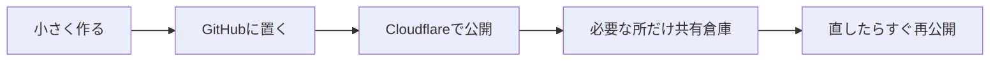

| # | ポイント | 一言で |
|---|----------|--------|
| 1 | 全部を最初から完璧にしない | まず出して、あとで直す |
| 2 | データの置き場を分ける | 自分用 / URL配布 / みんなで共有 |
| 3 | Cursor → プッシュ → 自動公開 | CI/CD 感が出る |
| 4 | 速さに安心を足す | 自動テストと品質ゲート |

小さな Web を「動くところまで」早く出すとき、全部をサーバーや DB に載せると重くなります。逆に、共有が必要な機能まで端末だけに閉じると成立しません。  
**役割ごとに置き場を分ける**ことと、**実装と公開を同じループで回す**ことが、今回いちばん効きました。

---

## なにをつくった？

ことほぎは、幹事・司会の負担を減らし、会場の一体感をつくるためのツール群です。紹介ページを入口に、3つの余興アプリへ進める構成にしました。

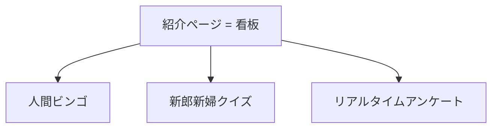

| 名前 | できること | たとえ |
|------|------------|--------|
| 紹介ページ | アプリの入口 | お店の看板 |
| 人間ビンゴ | ゲスト同士が話しかけてマスを埋める | 紙のビンゴ |
| 新郎新婦クイズ | 4択クイズ | 宴会のクイズ |
| リアルタイムアンケート | 会場でその場投票 | 挙手の代わり |

- **ビンゴ / クイズ** … 問題やマス設定を URL に載せて配れる。特別なサーバー同期は不要  
- **アンケート** … 司会の画面とゲストの票を同じ状態にしたいので、後述の **KV** を使う  

公開サイト: [ことほぎ](https://kotohogi.nozoisfun.workers.dev/)

技術的には、紹介ページとアンケート API は Next.js、余興 UI の本体は `public/app-tools/` 配下の静的 HTML です。余興画面を軽く保ちつつ、必要な所だけサーバー側の仕組みを足す、という割り切りです。

---

## いちばん大事：データの置き場を3つに分ける

設計の核心はここです。**全部を同じ場所に置かない**。

二次会アプリでは、データの性質が混ざりがちです。

- 自分のスマホにだけあればいいもの（入力した名前など）  
- みんなに同じ設定を配りたいもの（クイズ問題など）  
- みんなで同じ数字を見続けたいもの（アンケート票など）  

これを1つのデータベースにまとめると、準備も運用も重くなります。今回は次の3つに分けました。

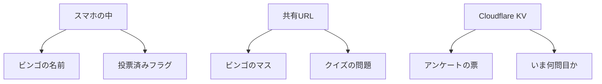

| 種類 | 例 | 置き場 | なぜ？ |
|------|----|--------|--------|
| 1. 自分だけ | マスに書いた名前 | スマホの中 | 他人と共有しなくていい |
| 2. 配りたい設定 | クイズ問題 | URL の中 | DB なしで同じ問題を配れる |
| 3. みんなで同じ数字 | アンケート票 | **KV（共有ロッカー）** | 司会画面とゲスト画面で一致が必要 |

この分け方のおかげで、ビンゴ／クイズは「リンクを配る」だけで完結し、アンケートだけクラウド側の倉庫を用意すればよくなりました。  
**全部をクラウドにする必要はない**、というのが今回の実務的な結論です。

---

## 全体の流れ（公開まで）

開発から公開までは、だいたい次の一本道です。手元で完成させてから別途サーバーを借りる、というより、**GitHub に置いた瞬間から公開パイプラインに乗る**イメージです。

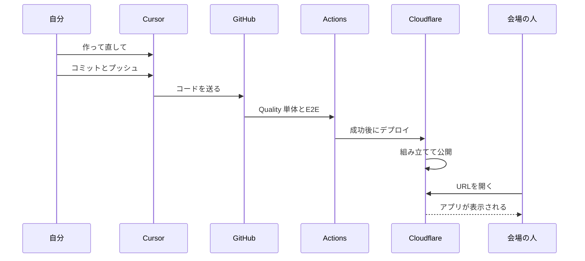

| 順番 | やること | たとえ |
|------|----------|--------|
| 1 | Cursor で作る・直す | 原稿を書く |
| 2 | GitHub に送る | 原稿を共有フォルダへ |
| 3 | Actions でテスト | 校正する |
| 4 | Cloudflare が公開 | 印刷して貼り出す |
| 5 | URL で確認 | 掲示板を見に行く |

ポイントは、公開を自分の PC だけでやらなくてもよいことです。  
いまのリポジトリでは **GitHub Actions が品質ゲート（単体＋E2E）を通してからデプロイ**します。Cloudflare の Git 連携（非本番ビルドなど）も併用できます。  
今回いちばん感動したのも、この「送ったら載る」感覚でした。

---

## Cloudflare を図で理解する

Cloudflare には色々なサービスがありますが、今回メインで使ったのは次の2つです。

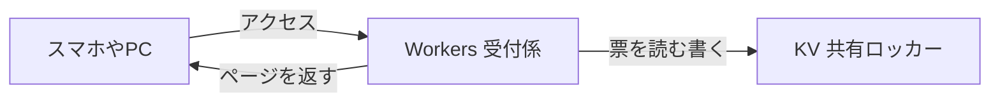

| 名前 | 役割 | たとえ |
|------|------|--------|
| **Workers** | アクセスに応じてページや投票処理をする | 受付係 |
| **KV** | 鍵と中身のペアでデータを置く | 共有ロッカー |

**Workers** は、自分でサーバー機を24時間起動し続けなくても、アクセスが来たときに処理して返せる実行環境です。紹介ページや API、静的な余興 HTML の配信も、この仕組みの上で動かしています。

**KV** は Key-Value Store の略で、「鍵の名前」と「中身」をペアで置く倉庫です。アンケートでは、たとえばルームコード `LOVE` に対して `poll:LOVE` のような鍵を作り、質問・票数・いま何問目か、を JSON で保存します。

### なぜアンケートだけ KV が必要か

ビンゴやクイズは、「同じ設定を配る」ことが主目的です。一方アンケートは、**複数の端末が同じカウンターを見続ける**必要があります。

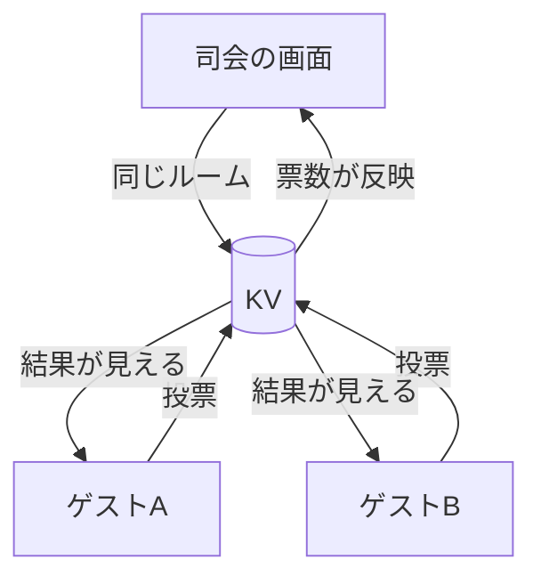

| アプリ | みんなで同じ中身？ | 方法 |
|--------|--------------------|------|
| ビンゴ・クイズ | だいたい不要 | URL で問題を配る |
| アンケート | **必要** | **KV** |

司会が結果を出すタイミングで、ゲスト側にも同じ結果が見える。この「会場の一体感」のために KV を入れました。

### メモリだけだとダメな理由

「サーバーのメモリに票を足せばいいのでは？」と思うかもしれません。Workers では、アクセスごとに別の実行場所（受付係）が対応することがあります。

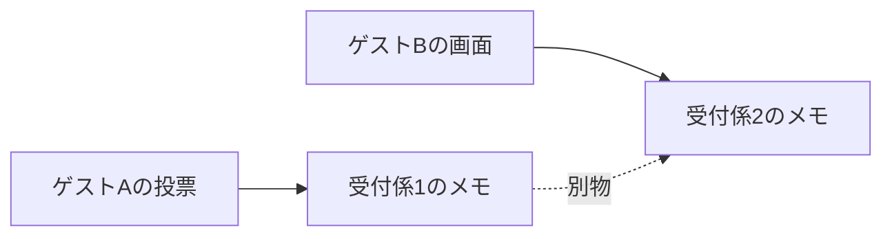

受付係が複数いると、メモがバラバラになります。だから「みんなで見る数字」は、共有できる倉庫（KV）に置きます。

あわせて、アンケートのデータはだいたい **24時間で消える** 設定にしました。二次会が終わったあとに長く残す必要がない、という前提です。

---

## アンケート：司会とゲストの流れ

アンケートは、技術以前に **会場オペ** が大事です。誰が進行し、誰が投票し、いつ結果を見せるか。そこを役割で固定しました。

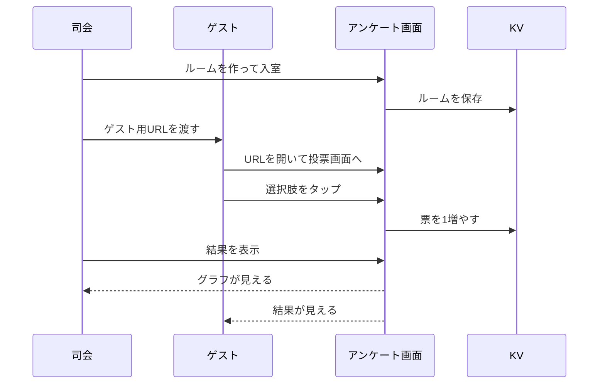

| 役割 | やること | やらないこと |
|------|----------|--------------|
| 司会（Host） | ルーム作成・次の質問・結果表示 | **投票しない** |
| ゲスト（Guest） | 投票 | 進行操作 |

初版では Host も選択肢を押せてしまい、票に混ざる余地がありました。会場では司会が誤操作しやすいので、**Host は表示と進行だけ**に直しています。  
結果も、Host が「結果を表示」するまでゲスト側に出さないようにし、発表のタイミングを司会が握れるようにしました。

### ゲスト用 URL（これだけで入れる）

```text
.../wedding-poll/index.html?room=LOVE
```

| ステップ | 誰が？ | 内容 |
|----------|--------|------|
| 1 | 司会 | Host で入室 |
| 2 | 司会 | ゲスト用 URL をコピーして配る |
| 3 | ゲスト | リンクを開く → すぐ投票 |
| 4 | 司会 | タイミングを見て結果表示 |

会場では、モード選択やコード手入力が多いほど詰まります。  
**リンク1本で Guest 入室できる**ようにしたのは、そのためです。Host がまだルームを作っていない場合は、準備完了まで待って自動で入れるようにもしてあります。

---

## Cursor で感動したこと

今回いちばん強く残ったのは、実装だけでなく **Git のコミット＆プッシュまでエージェントに依頼できる**ことでした。

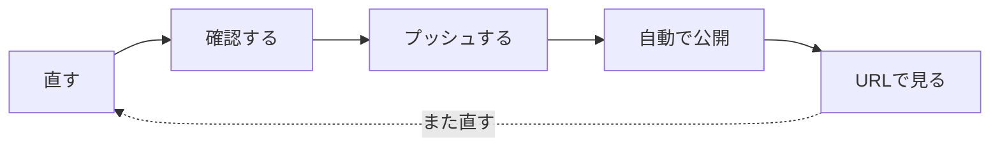

| | 昔 | 今回 |
|--|----|------|
| コード | 自分で書く | Cursor に頼む |
| Git | 自分で操作 | 「コミット＆プッシュして」 |
| 公開 | 手作業が多い | Cloudflare が自動 |
| 感覚 | 工程が多い | **会話の延長で出荷** |

従来は「作る人」と「出す人」の作業が分かれがちでした。今回は、直す会話の直後に出荷まで進めるので、小さな改善をためずに本番へ載せられます。  
約1日のあいだに、公開後の改善もすぐ反映しました。

| 改善 | 効果 |
|------|------|
| ビンゴ達成に日付と秒 | 記録がわかりやすい |
| Host は投票不可 | 司会が誤って票を入れない |
| `?room=` で即投票 | ゲストが迷わない |

この速さは強い一方で、確認なしの自動出荷は危険でもあります。自分では次を守るようにしています。

### 任せきりにしないチェックリスト

| チェック | なぜ？ |
|----------|--------|
| 変更内容をざっと見る | 意図しない変更を防ぐ |
| 秘密情報を上げない | パスワード等が漏れる |
| プッシュ先を確認 | 本番に影響するため |

```text
便利さ × 自分の確認 = 安心できる速さ
```

Cursor の価値は「全部任せて楽をする」ことより、**短い改善ループを回せる**ことにある、というのがいまの実感です。

---

## 困ったこと → 学び

公開までの途中では、いくつか典型的な詰まり方をしました。失敗そのものより、**次に活かせる学び**として残します。

| 困ったこと | 原因のイメージ | 学び |
|------------|----------------|------|
| どのフォルダを上げる？ | 手動アップロードだと思っていた | GitHub に置けば Cloudflare が組み立てる |
| 公開の直前でエラー | KV の番号が仮のまま | 共有ロッカーの設定を忘れない |
| 自分の PC で公開コマンドが失敗 | 環境の差 | GitHub 連携の方が安定しやすい |

特に印象的だったのは、「ビルドは成功したのにデプロイだけ失敗」パターンです。アプリ本体ではなく、KV の ID が仮のまま残っていたのが原因でした。  
**アプリコードが正しくても、基盤設定が未完了だと公開できない**、という当たり前を、実体験で学びました。

### 公開の正しいイメージ

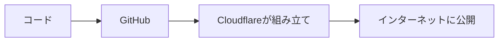

`node_modules`（依存パッケージの巨大フォルダ）は、自分でアップロードする必要はありません。Cloudflare 側のビルドで入ります。  
「何を Git に含めて、何を含めないか」を README に地図として書いておくと、後から見ても迷いにくいです。

---

## 実践するときの順番

同じことをもう一度やるなら、次の順番が再現しやすいです。最初から全部を同時にやらないのがコツです。

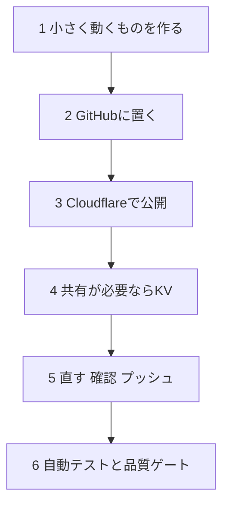

| 順番 | やること | ゴール |
|------|----------|--------|
| 1 | 小さく動くものを作る | まず1画面でもOK |
| 2 | GitHub に置く | コードの保管庫 |
| 3 | Cloudflare と連携 | URL で見える |
| 4 | 必要なら KV | みんなで同じ数字 |
| 5 | 直す→確認→プッシュ | 改善ループ |
| 6 | 自動テスト | 速さ＋安心（単体・E2E・デプロイ前ゲート） |

**出してから直す。**  
最初から認証・厳密な同時制御・完璧なデザインまで入れると、1日では形になりにくいです。まず URL で触れる状態をつくり、会場目線で直す方が早い、というのが今回の実感です。

---

## 速さに安心を足す：自動テストを入れた

公開ループが速くなると、次に気になるのは **「壊れたまま出していないか」** です。  
人手の確認だけでは、直すたびに同じ確認コストがかかります。そこで、公開後の改善ループの延長として、自動テストを足しました。

方針はデータの置き場と同じです。**全部を一度に完璧にしない。壊れたら一発で分かる所から入れる。**

### テストも「置き場」を分ける

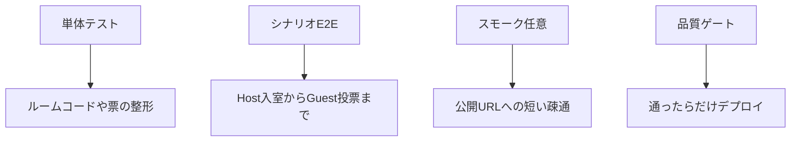

| 層 | なにをするか | コマンド例 | 保証すること |
|----|--------------|------------|--------------|
| 単体 | 部品の入出力 | `npm test` | ルーム正規化・票配列などが仕様どおりか |
| シナリオ（E2E） | ブラウザ自動操作 | `npm run test:e2e` | LP導線・ビンゴ達成・アンケート Host/Guest など |
| スモーク（任意） | 公開URLへの短い通信 | `npm run smoke` | 非本番が生きているかの最低確認 |

本番の KV を CI から直接叩かないこと、テスト用ルームは `T` 始まりにすること、有料のテスト SaaS は使わないことも最初に決めました。  
会場データを汚さない／課金を増やさない、という現場目線の制約です。

### シナリオはガーキン記法で書いた

E2E は「前提・もし・ならば」の **ガーキン記法** でシナリオを書き、Playwright で動かしています。  
仕様書を読んだ人と、テストコードの意図がずれにくいのが利点です。

例（アンケートの最短経路）:

```gherkin
# language: ja
シナリオ: Hostが入室しGuestが投票できる
  前提 アンケート開始画面を開いている
  もし Hostとして新しいテストルームに入室する
  ならば Hostのセッション画面が表示される
  かつ ゲスト用URLが表示される
  もし GuestがそのURLで先頭の選択肢に投票する
  ならば Guestは投票済みと表示される
```

カバーしている主なストーリーは次のとおりです。

| ID | 内容 | ねらい |
|----|------|--------|
| SC-LP-02 | LP から3アプリへ遷移 | 導線が死んでいない |
| SC-POLL-01/02 | Host 入室 → Guest 投票 → 結果表示 | 会場オペの最短経路 |
| SC-POLL-03 | Host は投票できない | 誤操作を防ぐ UX |
| SC-BINGO-01 | 名前入力でビンゴ＋日時 | 達成体験が壊れていない |
| SC-QUIZ-01 | 共有 URL で同じ問題 | URL 配布が成立する |

実行すると **動画（webm）** が残ります。失敗したとき「どこで止まったか」を目で追えるので、ログだけより現場感があります。

```powershell
npm run test:e2e:install   # 初回だけ（Chromium のダウンロード）
npm run test:e2e
npm run test:e2e:report    # 動画付きレポート
```

### いつ強制で走らせるか

「速いまま」にするには、確認を **適切なタイミングだけ** 挟む必要があります。

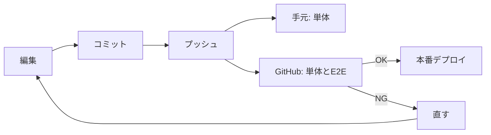

| タイミング | 場所 | 強制する内容 | 理由 |
|------------|------|--------------|------|
| コミット | 手元 | なし | 途中保存を妨げない |
| プッシュ直前 | 手元（husky） | 単体だけ | 数秒で壊れたロジックを止める |
| プッシュ / PR | GitHub Actions | 単体 + E2E | Linux 上の正。動画も残る |
| main への公開前 | Deploy ワークフロー | 同じ品質ゲートをもう一度 | 壊れたままデプロイしない |

本番相当の動き（Workers / KV）は、単体だけでは足りません。  
**プレビュー（非本番）で触ってから main に載せる**、という順番は、公開時と同じ考え方です。

### 途中で見つけた本番バグ

自動テストを書きながら、アンケート入室直後に Guest の選択肢が押せない不具合にも当たりました。  
原因は「処理中フラグを下ろしたあとに画面を描き直していなかった」こと。人の手でも再現できますが、E2E が同じ操作を毎回やるので、逃げにくくなります。

**テストは品質保証のためだけではない。仕様と実装のズレを見つける道具にもなる**、という実感です。

### まだ残していること

全部を自動化したわけではありません。

| これから | 理由 |
|----------|------|
| API 単体の厚み | ストア境界をモックしやすくしてから足す |
| プレビュー専用 KV の分離 | 試し投票が本番データに混ざらないようにする |
| Branch protection | マージボタン自体を赤のまま止められないと、ゲートが弱い |

まずは「壊れたら一発で分かる」層と「テスト通過後にデプロイ」までを入れた段階です。  
速さの型は残したまま、安心を足す、という Try の第一歩、という位置づけです。

---

## 振り返り：作り方の KPT

ここまでの進め方を、自分用の振り返りとして **KPT** でまとめます。

| 用語 | 意味 |
|------|------|
| **Keep** | うまくいったので、次も続けたいこと |
| **Problem** | つまずいた・弱かったこと |
| **Try** | Problem を減らすために、次に試すこと |

KPT は「よかった／悪かった」で終わらせず、**次の行動に変える**ための枠です。

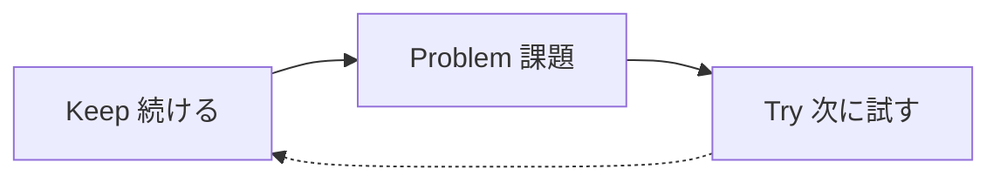

### Keep（よかったので続けたい）

いちばん効いたのは、**完成度より「まず届く形」を優先したこと**です。二次会ツールは会場で使えなければ意味がないので、「公開できる最小構成 → 触って直す」の方が、設計を長く練るより成果が出ました。

| 項目 | 補足 |
|------|------|
| **まず出して、あとで直す** | LP・3アプリ・Cloudflare 公開まで約1日。最初から認証や厳密な同時投票制御まで入れると、届かなかった可能性が高い |
| **データの置き場を分ける** | 「自分だけ／URLで配る／みんなで見る」を分けた。全部を DB にすると重いし、全部を端末だけにするとアンケートが成立しない |
| **Cursor → プッシュ → Cloudflare** | 実装の会話の延長で出荷できた。ビンゴの時刻表示や Poll の UX 改善も、同じ日に本番へ載せられた |
| **本番（または本番相当）で触ってから直す** | 頭の中の仕様より、実際に Host／Guest をやると弱点が見える。Host 投票や Guest 入室の改善はここで生まれた |
| **スクショやログを共有して進める** | Cloudflare の画面やビルドログをそのまま見せる方が、言葉だけの説明より早い。遠回りが減った |
| **`docs/` に要件・設計を残す** | コードだけだと「なぜそうなったか」が消える。サイト非公開の `docs/` に置いたのは、公開物と内部資料を分ける意味でもよかった |

Keep を一言で言うと、**小さく出して、必要な共有だけクラウドに寄せ、出荷ループを回した**ことです。

### Problem（つまずいた・弱かったところ）

速さと引き換えに、**準備不足と初回 UX の甘さ**が出ました。失敗自体は学習になっているので、次は「同じ失敗を繰り返さない仕組み」が必要です。

| 項目 | 補足 |
|------|------|
| **「何をデプロイするか」が最初あいまい** | 静的サイト感覚だと「どのフォルダをアップロード？」となりやすい。実際は Git のソースを Cloudflare がビルドする。ここを最初に図解しておくと迷わない |
| **設定の仮置きを本番に持ち込んだ** | `wrangler.jsonc` の KV ID が `REPLACE_WITH_...` のまま。ビルドは通ってもデプロイで落ちる、という典型。仮値は「まだ本番不可」の印だと意識する |
| **小さなミスでビルドが落ちた** | 型定義の `#` コメントなど、言語／ツールの前提を知らないと一瞬で止まる。エラーログをそのまま共有して直す流れはよかったが、最初から防げる類でもある |
| **アンケート初版の UX が弱かった** | Host が投票できてしまう、Guest が URL ですぐ入れない、など。技術的には動いていても、会場オペとしては弱い。機能完成と体験完成は別、という学び |
| **記事の読者想定が途中でブレた** | 技術詳細 ↔ 説明の粒度 ↔ 図の文法修正、と手戻りが多かった。書く前に「誰が何を持ち帰る記事か」を決めていないと起きやすい |
| **手元環境の制約** | Windows ARM ではローカルの Workers preview が不安定なことがある。最初から「GitHub 連携で Linux ビルド」と決めた方が、全体としては早かったかもしれない |

Problem を一言で言うと、**設定の取りこぼし・初回体験の粗さ・前提の後出し**で手戻りが出た、です。

### Try（次に試すこと）

Try は Problem への対策です。いまの速さを捨てるのではなく、**速さの前に短い確認を挟む**イメージです。

| 項目 | 補足 |
|------|------|
| **自動テストと品質ゲート** | 単体・シナリオ E2E・push/デプロイ前の強制。速さの前に短い確認を挟めるようになった |
| **公開前チェックリスト** | KV の ID／binding、ビルドコマンド、Host／Guest の最低動作 |
| **「出す前に一度使う」** | 自分で司会役とゲスト役を両方やる |
| **危険な変更はプレビューブランチ** | 非本番で試し、問題なければ main |
| **プレビュー KV の分離・Branch protection** | まだ手作業設定が残る。ゲートを「破られにくい」形にするのが次 |

### Keep / Problem / Try のつながり

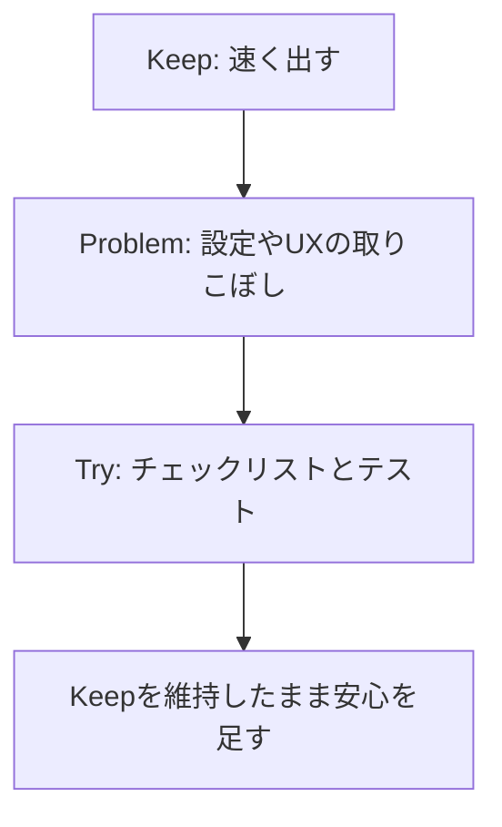

| | 内容 |
|--|------|
| Keep | 小さく出して、共有が必要な所だけクラウドに寄せ、Cursor で出荷まで回す |
| Problem | 設定ミス・初回 UX・前提の後出しで手戻りが出た |
| Try | チェックリストと自動テストで、速さを保ったまま安心を足す（第一歩は実装済み。KV分離と保護ルールが次） |

今回の作り方は「遅い」のではなく、**速い出荷の型ができた**状態です。  
その型に **壊れ検知** を足し始めた、というのがいまの位置です。

---

## まとめ（1枚で）

最後に、全体を1枚の図と表にまとめます。

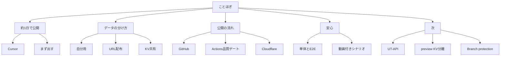

| 項目 | 内容 |
|------|------|
| つくったもの | 二次会向け LP＋ビンゴ＋クイズ＋アンケート |
| 公開 URL | [https://kotohogi.nozoisfun.workers.dev/](https://kotohogi.nozoisfun.workers.dev/) |
| 時間 | 約1日（Cursor 中心） |
| コツ | データの置き場を分ける／テストも層を分ける |
| 感動 | コミット＆プッシュ → 自動公開（CI/CD 感） |
| 振り返り | 上記の KPT |
| 安心 | 単体・シナリオ E2E・デプロイ前ゲート（動画付き） |
| 次 | API 単体の厚み、プレビュー KV 分離、Branch protection |

小さく出して、必要な共有だけクラウドに寄せ、出荷ループを回す。  
そのうえで、自動テストで速さに安心を足す。これが、今回の一連の学びです。

---

## リンク

| 種類 | URL |
|------|-----|
| 本番サイト | [https://kotohogi.nozoisfun.workers.dev/](https://kotohogi.nozoisfun.workers.dev/) |
